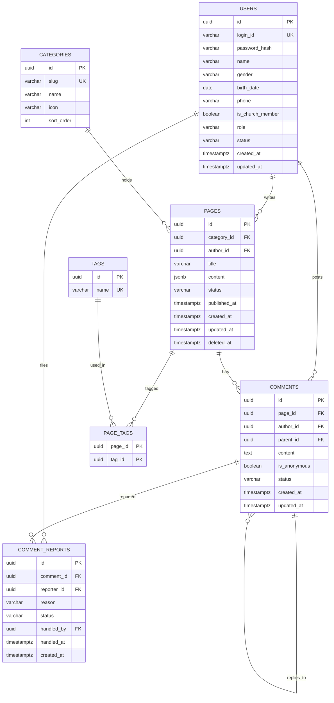

# 열린위키 — 사이트맵 & ERD

> 작성일: 2026-07-31
> 기준 디자인: Figma `yullinwiki-joseph` (fileKey `zgimD0nr4SebHWiMLn4itq`)
> 스택: Next.js (App Router) + TypeScript + Supabase(Postgres) / Vercel 배포

---

## 0. 확정된 아키텍처 전제

| 항목        | 결정                                                                                                         |
| ----------- | ------------------------------------------------------------------------------------------------------------ |
| 현재 백엔드 | Supabase (Postgres)                                                                                          |
| 미래 백엔드 | Java Spring Boot                                                                                             |
| **DB**      | **Postgres 유지** (Supabase Postgres → RDS Postgres 이관은 `pg_dump` 한 번)                                  |
| 배포        | Vercel + Supabase                                                                                            |
| 격리 대상   | Supabase **플랫폼 기능**(supabase-js SDK, Auth, RLS, Edge Function) — Postgres 자체는 표준이므로 락인이 아님 |

**보험 조항**: DB 안에 넣는 로직(View / RPC)은 `/supabase/migrations/` 아래 SQL 파일로만 관리하고,
개수를 의도적으로 적게 유지한다. 새 RPC를 만들 때마다 "service 레이어 TS 코드로 충분한가"를 한 번 묻는다.
만에 하나 MySQL로 방향이 틀어져도 재작성 대상이 목록화되어 있어야 견적이 나온다.

---

## 1. 사이트맵

### Public (User)

| 라우트               | 화면                        | 비고                                   |
| -------------------- | --------------------------- | -------------------------------------- |
| `/`                  | Home                        | 카테고리 진입, 최근 게시물 3개, 검색   |
| `/login`             | 로그인                      | 에러 상태(잘못된 아이디/비밀번호) 포함 |
| `/signup`            | 회원가입                    | 아이디 중복확인, 비밀번호 형식 검증    |
| `/categories`        | 항목별 게시물               | 전체 카테고리                          |
| `/categories/[slug]` | 항목 - 공간 / 섬김 / 열청 … | 사이드 카테고리 + 목록                 |
| `/recent`            | 최근 추가 게시물            |                                        |
| `/pages/[id]`        | 게시물 상세 (Article)       | 목차, 태그, 참고문헌, 댓글             |
| `/search?q=`         | 검색 결과                   | 페이지네이션                           |
| `/mypage`            | 마이페이지                  | 회원정보 + 내 댓글 모아보기            |
| `/mypage/edit`       | 회원정보 수정               | 비밀번호 변경 팝업                     |
| `/mypage/withdraw`   | 계정 삭제                   | 아이디 재입력 + 동의 체크              |

### Admin

| 라우트                   | 화면               | 비고                                |
| ------------------------ | ------------------ | ----------------------------------- |
| `/admin/login`           | AdLogin            |                                     |
| `/admin`                 | AdMypage 대시보드  | 최근 댓글 / 최근 신고 / 바로가기    |
| `/admin/pages/new`       | AdNewpost 에디터   | 임시저장 · 미리보기 · 게시          |
| `/admin/pages/[id]/edit` | 에디터 (수정)      |                                     |
| `/admin/pages/[id]`      | AdContent          | 관리자 뷰 (수정 · 삭제 버튼)        |
| `/admin/drafts`          | AdSaved 임시저장소 | 다중선택 삭제                       |
| `/admin/comments`        | 최근 달린 댓글     | 페이지네이션                        |
| `/admin/reports`         | 신고 관리          | 댓글 삭제 / 신고 무시 / 사용자 차단 |

### 구조 결정 — 화면 중복 제거

Figma에 `Home`, `항목별 게시물`, `항목 - 공간`, `검색 결과`가 User용과 Admin용으로 **두 벌씩** 존재하지만,
차이는 `Header` → `AdHeader` 뿐이다.

→ **같은 public 라우트를 쓰고, 헤더 컴포넌트만 세션 role에 따라 교체한다.**
어드민 전용 라우트는 실제로 기능이 다른 것만 남긴다: 에디터, 임시저장소, 신고 관리, 대시보드.

### 디자인에 없지만 필요한 화면

- [ ] 아이디 / 비밀번호 찾기
- [ ] 404 / 에러 페이지
- [ ] 카테고리 관리 (어드민이 항목을 추가·수정하는 화면 부재 — 현재는 시드 데이터로만 존재)
- [ ] 회원 관리 목록 (차단이 신고 화면에서만 가능)

---

## 2. ERD

### enum 값

| 컬럼                     | 값                                                |
| ------------------------ | ------------------------------------------------- |
| `users.role`             | `USER`, `ADMIN`                                   |
| `users.status`           | `ACTIVE`, `BLOCKED`, `WITHDRAWN`                  |
| `pages.status`           | `DRAFT`, `PUBLISHED`                              |
| `comments.status`        | `VISIBLE`, `DELETED`                              |
| `comment_reports.status` | `PENDING`, `RESOLVED_DELETED`, `RESOLVED_IGNORED` |

---

## 3. 설계 근거

### `status` 컬럼 — 플래그 난립 금지

`is_blocked` + `is_deleted` + `is_active`로 쪼개면 세 값이 서로 모순되는 상태가 생긴다.
단일 `status` enum이면 그런 상태가 애초에 표현 불가능하고, JPA로 옮길 때 `@Enumerated`
하나로 끝난다. (프로젝트 지침 6번 "비슷한 플래그 변수 난립 금지")

### 임시저장소를 별도 테이블로 만들지 않음

어드민의 `임시저장소` 화면은 `pages WHERE status = 'DRAFT'`이다.
별도 테이블이면 게시 시점에 row를 옮겨야 하고, 그 순간 id가 바뀌어 댓글·링크가 깨진다.

### 본문은 `jsonb content` 한 컬럼

Figma 에디터의 `nodes` 컴포넌트(h1 / h2 / h3 / paragraph / link / ul / ol / image / hr)가
그대로 블록 배열이 된다.

- 블록을 별도 테이블로 쪼개면 조회마다 조인 + 정렬이 붙는데, 게시물이 항상 통째로 읽히는
  위키에선 이득이 없다
- **목차(TOC)는 저장하지 않는다** — 렌더 시점에 h1/h2를 훑어서 생성
- **참고문헌도 content 안의 블록** — 별도 테이블 불필요

> Postgres 유지 결정의 실익이 나오는 지점. `jsonb`는 MySQL `json`과 인덱싱·연산자가
> 전혀 다르다. Postgres 확정이므로 `jsonb` + GIN 인덱스를 마음 놓고 쓴다.

### 검색은 Postgres FTS

`to_tsvector`로 제목 + 본문 텍스트를 인덱싱. View 하나로 감싸두면
나중에 Spring에서 native query로 그대로 재사용된다. (지침 5번이 의도한 케이스)

---

## 4. 확정된 결정 (2026-07-31)

### 익명 댓글 — 로그인 필수 + 표시만 익명

`comments.author_id`는 **NOT NULL**. `is_anonymous`는 화면 표시 여부만 제어한다.

근거: 디자인에 **사용자 차단**과 마이페이지 **내 댓글 모아보기**가 있다. 비로그인 익명이면
차단할 대상이 없고(IP 차단은 무의미) 모아볼 수도 없다. DB는 작성자를 알되 화면에만 "익명"으로 뜬다.

### 유저 북마크 — 만들지 않음

Figma `card`의 `saved default / saved empty checkbox / saved checked` variant는 어드민
`임시저장소`의 **다중선택 삭제 체크박스**와 짝이 맞는다 (AdSaved가 `saved check list`를 사용).
유저용 북마크 UI는 어디에도 없다.

나중에 필요해지면 `bookmarks(user_id, page_id)`는 기존 테이블을 안 건드리는 순수 추가라
비용이 거의 없다. → 미룬다.

### 수정 이력 — 테이블 + 쓰기만, 조회 UI는 나중

`page_revisions` 테이블을 만들고 `pageService.update()`에서 이전 버전을 insert한다.
조회·복원 UI는 만들지 않는다.

근거: 마이그레이션 비용이 아니라 **과거 이력은 소급이 안 된다**는 게 핵심. 나중에 켜면
그 시점부터만 쌓인다. 다만 개방형 위키가 아니라 어드민 전용 지식베이스라 반달리즘 복구
수요는 없고, 남는 가치는 "실수로 날린 문단 되돌리기" 정도 → 쓰기만 켜두는 절충.

### 계정 삭제 — soft delete + PII 익명화

`status = 'WITHDRAWN'`으로 두고 개인정보 컬럼(`name`, `gender`, `birth_date`, `phone`)을 NULL로 비운다.
hard delete하면 `comments.author_id`가 NOT NULL이라 댓글까지 연쇄 삭제된다.
디자인의 "복구 불가능" 문구는 재로그인 불가를 뜻하는 것으로 해석한다.

---

## 5. 작업 순서

1. **마이그레이션 SQL** (`supabase/migrations/001_init.sql`) — 위 스키마 + 카테고리 시드
2. **도메인 타입** (`/lib/types`) — DB row가 아닌 `Page`, `Comment`, `User` 도메인 모델
3. **pages 읽기 수직 슬라이스**
   `pageRepository` → `pageService` → `GET /api/pages` → 목록 UI 한 화면
4. **인증** (`/lib/auth`) + 어드민 로그인
5. **에디터** (가장 큰 덩어리, 마지막)

3번을 먼저 얇게 관통시키는 이유: 이 프로젝트의 레이어 규칙이 실제로 성립하는지 검증하는
최소 단위이기 때문. 여기서 규칙이 어색하면 코드가 쌓이기 전에 고치는 게 훨씬 싸다.
